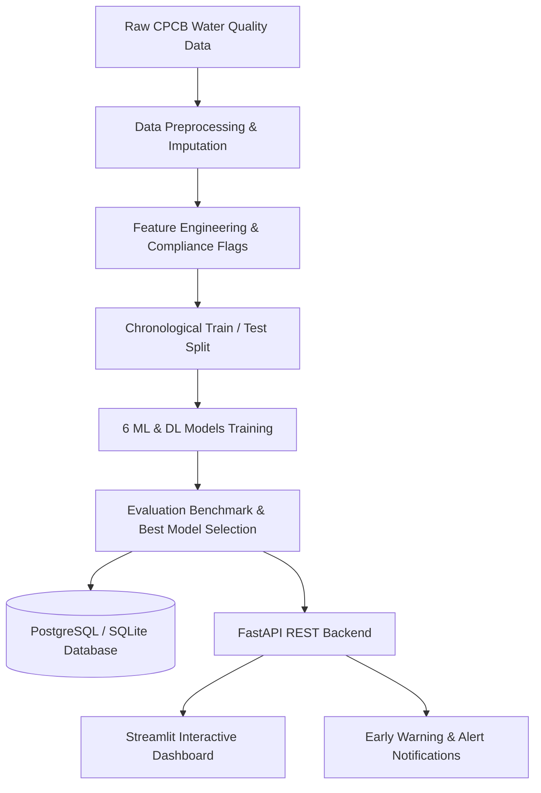

# 🌊 Aquanga – Predictive Water Monitoring & Early Warning System

[](https://www.python.org/)
[](https://fastapi.tiangolo.com/)
[](https://streamlit.io/)
[](https://www.postgresql.org/)
[](https://www.docker.com/)
[](https://pytest.org/)

**Aquanga** is a production-grade, end-to-end water quality forecasting and environmental early warning system for Central Pollution Control Board (CPCB) monitoring stations along the Ganga River basin. It integrates machine learning and deep learning time-series forecasting, real-time risk assessment, a RESTful FastAPI backend, a PostgreSQL relational datastore, and an interactive Streamlit geospatial dashboard.

---

## 📌 Table of Contents
1. [Problem Statement](#-problem-statement)
2. [System Architecture](#-system-architecture)
3. [Dataset & Preprocessing](#-dataset--preprocessing)
4. [Feature Engineering](#-feature-engineering)
5. [Machine Learning & Deep Learning Models](#-machine-learning--deep-learning-models)
6. [Model Evaluation & Benchmark](#-model-evaluation--benchmark)
7. [Environmental Risk & Early Warning System](#-environmental-risk--early-warning-system)
8. [FastAPI REST API](#-fastapi-rest-api)
9. [Database Architecture & Seeding](#-database-architecture--seeding)
10. [Interactive Streamlit Dashboard](#-interactive-streamlit-dashboard)
11. [Project Structure](#-project-structure)
12. [How to Run Locally](#-how-to-run-locally)
13. [Docker & Containerized Deployment](#-docker--containerized-deployment)
14. [Testing Suite](#-testing-suite)
15. [Generalization & Future Improvements](#-generalization--future-improvements)

---

## 🎯 Problem Statement
The Ganga River supports over 400 million people but faces severe ecological stress from municipal sewage, industrial effluents, and agricultural runoff. Traditional water quality monitoring relies on post-hoc manual laboratory testing, often detecting hypoxic events (low Dissolved Oxygen) and severe microbial surges days after they occur.

**Aquanga** solves this by:
- Forecasting future **Dissolved Oxygen (DO)** levels using historical multi-parameter time-series observations.
- Calculating environmental risk scores based on statutory CPCB water quality criteria.
- Automatically generating actionable early warnings to alert environmental authorities before ecological thresholds are breached.

---

## 🏛️ System Architecture



### Tech Stack:
- **Language**: Python 3.11 / 3.13
- **Data Science**: Pandas, NumPy, Matplotlib, Seaborn
- **Machine Learning**: Scikit-learn, XGBoost
- **Deep Learning**: TensorFlow / Keras (1D CNN, LSTM, CNN+LSTM)
- **Backend**: FastAPI, Pydantic v2, Uvicorn
- **Database**: PostgreSQL 16, SQLAlchemy ORM, AsyncPG, Psycopg2
- **Frontend Dashboard**: Streamlit, Folium, Streamlit-Folium, PyDeck
- **DevOps & QA**: Docker, Docker Compose, Pytest

---

## 📊 Dataset & Preprocessing

The primary data source is the official Central Pollution Control Board (CPCB) multi-year Ganga River water quality observations (2011–2015) spanning 10 key monitoring stations:

1. **GANGA AT HARIDWAR D/S** (Uttarakhand)
2. **GANGA AT GARHMUKTESHWAR** (Uttar Pradesh)
3. **GANGA AT KANNAUJ U/S (RAJGHAT)** (Uttar Pradesh)
4. **GANGA AT KANNAUJ D/S, U.P** (Uttar Pradesh)
5. **GANGA AT KANPUR U/S (RANIGHAT)** (Uttar Pradesh)
6. **GANGA AT KANPUR D/S (JAJMAU PUMPING STATION)** (Uttar Pradesh)
7. **GANGA AT ALLAHABAD D/S (SANGAM), U.P.** (Uttar Pradesh)
8. **GANGA AT VARANASI D/S (MALVIYA BRIDGE), U.P** (Uttar Pradesh)
9. **GANGA AT TRIGHAT (GHAZIPUR)** (Uttar Pradesh)
10. **GANGA AT DAKSHINESHWAR** (West Bengal)

### Preprocessing Steps (`ml/preprocessing.py`):
- **Dynamic Header Parsing**: Converts wide multi-year CPCB format into a normalized long-format table `(location, year, do, bod, fecal_coliform)`.
- **Missing Value Imputation**: Employs temporal linear interpolation per station, forward/backward filling, and parameter median fallback without dropping stations (preserving all 10 monitoring locations).
- **Physical Validation**: Ensures non-negative parameters and enforces deduplication.

---

## ⚙️ Feature Engineering

To capture temporal trends without target leakage, features are constructed in `ml/feature_engineering.py`:

- **CPCB Criteria Flags**:
  - `do_good`: 1 if $\text{DO} \ge 5.0\text{ mg/L}$, else 0.
  - `bod_good`: 1 if $\text{BOD} \le 3.0\text{ mg/L}$, else 0.
  - `fecal_good`: 1 if $\text{Fecal Coliform} \le 2500\text{ MPN/100ml}$, else 0.
  - `water_quality_score`: Sum of compliance flags (Range: 0 to 3).
- **Temporal Lags**: $t-1$ and $t-2$ lag observations for DO, BOD, and Fecal Coliform.
- **Trend Velocity (Rate of Change)**: Defined strictly as $\Delta = \text{lag}_1 - \text{lag}_2$ prior to the forecast period to eliminate target leakage.
- **Sequence Reshaping (`ml/create_sequences.py`)**: Generates 3D tensors `(samples, time_steps, features)` for convolutional and recurrent architectures.

---

## 🔬 Machine Learning & Deep Learning Models

Six architectures are trained and compared under strict chronological validation (Training on 2011–2014, evaluating on held-out year 2015):

1. **Linear Regression (`ml/train_baseline.py`)**: Unregularized parametric baseline.
2. **Random Forest Regressor (`ml/train_baseline.py`)**: 100-tree ensemble capturing non-linear interactions.
3. **XGBoost Regressor (`ml/train_xgboost.py`)**: Gradient boosted decision trees with subsampling and regularization.
4. **1D CNN (`ml/train_cnn.py`)**: 1D temporal convolution extracting local feature patterns.
5. **LSTM (`ml/train_lstm.py`)**: Recurrent neural network learning sequential temporal dependencies.
6. **CNN + LSTM (`ml/train_cnn_lstm.py`)**: Hybrid architecture combining 1D Conv feature extraction with recurrent LSTM layers.

---

## 📈 Model Evaluation & Benchmark

Models were evaluated using standard regression metrics calculated exclusively on the held-out test year (2015):
- **MAE** (Mean Absolute Error, in mg/L)
- **RMSE** (Root Mean Squared Error, in mg/L)
- **$R^2$** (Coefficient of Determination)

### Actual Evaluation Results:

| Model Architecture | MAE (mg/L) | RMSE (mg/L) | $R^2$ Score | Ranking |
| :--- | :---: | :---: | :---: | :---: |
| **XGBoost Regressor** | **0.9896** | **1.4296** | **-2.4544** | 🥇 **Best Model** |
| **Random Forest** | 1.0600 | 1.4540 | -2.5733 | 🥈 Runner Up |
| **Linear Regression** | 1.3390 | 2.0000 | -5.7611 | 🥉 Baseline |
| **CNN + LSTM Hybrid** | 1.3893 | 1.9590 | -5.4870 | 4th |
| **1D CNN** | 1.5034 | 2.2270 | -7.3830 | 5th |
| **LSTM** | 1.6542 | 2.5420 | -9.9226 | 6th |

> **Data Science Insight**: On compact annual time-series datasets (50 observations across 10 stations), tree-based gradient boosting (XGBoost) and Random Forest outperform deep neural networks (CNN/LSTM) by avoiding overparameterization on short sequences.

---

## 🚨 Environmental Risk & Early Warning System

The risk evaluation engine (`app/services/risk_service.py`) calculates environmental risk by applying CPCB Class B (Outdoor Bathing / Aquatic Life) standards:

| Parameter | Good / Safe (0 pts) | Moderate Stress (1 pt) | Critical / Severe (2 pts) |
| :--- | :---: | :---: | :---: |
| **Dissolved Oxygen (DO)** | $\ge 5.0\text{ mg/L}$ | $4.0 - 5.0\text{ mg/L}$ | $< 4.0\text{ mg/L}$ (Hypoxic) |
| **Biochemical Oxygen Demand (BOD)** | $\le 3.0\text{ mg/L}$ | $3.0 - 6.0\text{ mg/L}$ | $> 6.0\text{ mg/L}$ |
| **Fecal Coliform** | $\le 2500\text{ MPN/100ml}$ | $2500 - 10000\text{ MPN/100ml}$ | $> 10000\text{ MPN/100ml}$ |

- **Risk Score 0–1 (`Low`)**: Normal water quality parameters.
- **Risk Score 2 (`Medium`)**: Moderate stress; elevated BOD or microbial counts.
- **Risk Score 3 (`High`)**: Critical hypoxia or severe fecal contamination requiring immediate ecological intervention.

---

## 🚀 FastAPI REST API

FastAPI provides an interactive OpenAPI / Swagger UI at `http://localhost:8000/docs`.

### Primary Endpoints:

- `GET /`: System status, version, and route manifest.
- `GET /health`: Health check with database connectivity diagnostics.
- `GET /stations`: List all registered Ganga monitoring stations.
- `GET /stations/{station_id}`: Station metadata and historical observations.
- `POST /predict`: Predict future DO, calculate CPCB risk score, risk level, and early warning message.
- `GET /alerts`: Query active pollution alerts and monitoring notices.

#### Sample Request (`POST /predict`):
```json
{
  "station_name": "GANGA AT KANPUR D/S (JAJMAU PUMPING STATION)",
  "station_id": 6,
  "do_lag1": 7.3,
  "bod_lag1": 7.7,
  "fecal_coliform_lag1": 40000.0,
  "do_change": 0.6,
  "bod_change": 0.9,
  "fecal_coliform_change": 26433.0,
  "forecast_year": 2016,
  "model_name": "best"
}
```

#### Sample Response:
```json
{
  "station": "GANGA AT KANPUR D/S (JAJMAU PUMPING STATION)",
  "station_id": 6,
  "forecast_year": 2016,
  "model_used": "best",
  "predicted_do": 7.76,
  "risk_score": 3,
  "risk_level": "High",
  "warning": "CRITICAL WARNING: Heavy organic pollution (BOD: 7.70 mg/L > 6.0); Severe microbial contamination (FC: 40000 MPN/100ml > 10,000). Immediate intervention recommended.",
  "parameters": {
    "do_lag1": 7.3,
    "bod_lag1": 7.7,
    "fecal_coliform_lag1": 40000.0
  }
}
```

---

## 🗄️ Database Architecture & Seeding

SQLAlchemy models (`app/database/models.py`) define four relational entities:
- `stations`: Geographic coordinates, river name, state, and location type.
- `water_quality`: Longitudinal DO, BOD, and Fecal Coliform measurements.
- `predictions`: Model inference audit log and forecast history.
- `alerts`: Active early warning records and severity levels.

To populate the database with verified CPCB station coordinates and observations:
```bash
python scripts/seed_database.py
```

---

## 🖥️ Interactive Streamlit Dashboard

The Streamlit dashboard (`dashboard/app.py`) provides an interactive interface:

1. **Header & System KPIs**: Monitored stations, average DO/BOD delta vs CPCB limits, and elevated risk counts.
2. **Dynamic Station Selector**: Automatically populates all stations present in the database.
3. **Interactive Ganga Basin Map**: Folium map with color-coded markers (Green = Low, Orange = Medium, Red = High) and rich HTML inspection popups.
4. **Temporal Charts**: DO forecast with threshold lines, BOD trends, logarithmic Fecal Coliform charts, and parameter profile bars.
5. **Basin Analytics**: Risk level distribution pie chart and correlation heatmap.
6. **ML Benchmark Tab**: Model comparison table and error metric charts.
7. **Early Warning Feed**: Expandable incident response cards for stations requiring intervention.

---

## 📁 Project Structure

```
Aquanga/
├── data/
│   ├── raw/
│   │   └── ganga_water_quality_2011_2015.csv
│   ├── processed/
│   │   ├── ganga_water_quality_clean.csv
│   │   └── ganga_water_quality_features.csv
│   └── external/
│       └── station_coordinates.json
│
├── notebooks/
│   ├── 01_data_understanding.ipynb
│   ├── 02_eda.ipynb
│   ├── 03_feature_engineering.ipynb
│   └── 04_model_experiments.ipynb
│
├── ml/
│   ├── __init__.py
│   ├── preprocessing.py
│   ├── feature_engineering.py
│   ├── create_sequences.py
│   ├── train_baseline.py
│   ├── train_xgboost.py
│   ├── train_cnn.py
│   ├── train_lstm.py
│   ├── train_cnn_lstm.py
│   └── evaluate.py
│
├── models/
│   ├── baseline/
│   │   ├── linear_regression.pkl
│   │   └── random_forest.pkl
│   ├── xgboost/
│   │   └── xgboost_model.pkl
│   ├── cnn/
│   │   └── cnn_model.keras
│   ├── lstm/
│   │   └── lstm_model.keras
│   ├── cnn_lstm/
│   │   └── cnn_lstm_model.keras
│   ├── scaler_X.pkl
│   ├── scaler_y.pkl
│   ├── model_comparison.json
│   ├── model_comparison.csv
│   ├── best_model_info.json
│   └── do_prediction_model.pkl
│
├── app/
│   ├── __init__.py
│   ├── config.py
│   ├── main.py
│   ├── routers/
│   │   ├── __init__.py
│   │   ├── prediction.py
│   │   ├── stations.py
│   │   └── alerts.py
│   ├── schemas/
│   │   ├── __init__.py
│   │   ├── prediction.py
│   │   └── station.py
│   ├── services/
│   │   ├── __init__.py
│   │   ├── prediction_service.py
│   │   ├── risk_service.py
│   │   └── alert_service.py
│   └── database/
│       ├── __init__.py
│       ├── database.py
│       ├── models.py
│       └── crud.py
│
├── dashboard/
│   ├── app.py
│   └── components/
│       ├── __init__.py
│       ├── map_view.py
│       ├── charts.py
│       ├── kpi_cards.py
│       └── model_comparison.py
│
├── tests/
│   ├── __init__.py
│   ├── test_preprocessing.py
│   ├── test_prediction.py
│   ├── test_api.py
│   └── test_risk.py
│
├── scripts/
│   ├── __init__.py
│   ├── train.py
│   └── seed_database.py
│
├── Dockerfile
├── docker-compose.yml
├── requirements.txt
├── .env.example
├── .gitignore
└── README.md
```

---

## 💻 How to Run Locally

### 1. Clone & Environment Setup
```bash
git clone https://github.com/madhavisolanki-ui/Aquanga.git
cd Aquanga
python -m venv venv
# On Windows:
venv\Scripts\activate
# On Linux/macOS:
source venv/bin/activate
```

### 2. Install Dependencies
```bash
pip install -r requirements.txt
```

### 3. Train Models & Evaluate Benchmark
```bash
python scripts/train.py
```

### 4. Seed Database
```bash
python scripts/seed_database.py
```

### 5. Launch FastAPI Backend
```bash
uvicorn app.main:app --host 0.0.0.0 --port 8000 --reload
```
API Documentation: `http://localhost:8000/docs`

### 6. Launch Streamlit Dashboard
```bash
streamlit run dashboard/app.py
```
Dashboard URL: `http://localhost:8501`

---

## 🐳 Docker & Containerized Deployment

Deploy the entire PostgreSQL + FastAPI + Streamlit stack with a single command:

```bash
docker compose up --build
```

### Services Started:
- **PostgreSQL Database**: `localhost:5432` (Health-monitored)
- **FastAPI Backend**: `http://localhost:8000`
- **Streamlit Dashboard**: `http://localhost:8501`

---

## 🧪 Testing Suite

Execute the test suite with:
```bash
pytest -v
```

### Test Coverage:
- `test_preprocessing.py`: Wide-to-long transformation, missing value imputation, compliance flags, chronological train/test split.
- `test_risk.py`: CPCB threshold evaluations, penalty points, risk scores, and alert triggers.
- `test_prediction.py`: Feature DataFrame assembly, model inference, and output schema validation.
- `test_api.py`: Integration tests for `/`, `/health`, `/stations`, `/predict`, and `/alerts`.

---

## 🔮 Generalization & Future Improvements

- **Arbitrary Station Support**: The pipeline dynamically reads station names and coordinates without hardcoding, supporting any new monitoring station added to the dataset.
- **Multi-Year Horizon**: Designed to support sliding multi-step forecasts as higher-frequency (monthly/daily) sensor telemetry becomes available.
- **IoT / Telemetry Ingestion**: Future support for streaming MQTT/Kafka sensors from online monitoring buoys.
